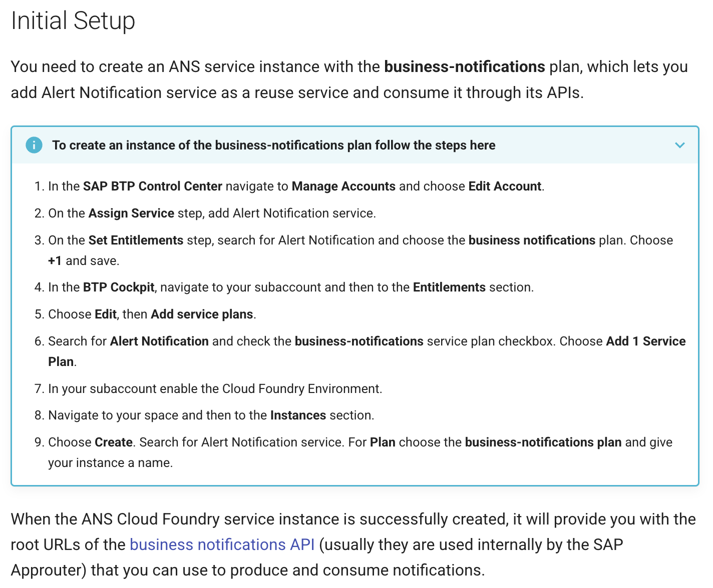

[](https://api.reuse.software/info/github.com/cap-java/cds-feature-notifications)

# cds-feature-notifications

## About this project

A CAP Java plugin that integrates SAP Alert Notification service (ANS) with the SAP Cloud Application Programming Model (CAP) for sending business notifications.

The `cds-feature-notifications` plugin enables out-of-the-box notification handling for CAP Java applications. Annotate CDS events with `@notification`, emit them from a handler or annotate entities with `@notifications` for automatic delivery triggered by CRUD events, actions, or functions. The plugin takes care of the rest and delivers notifications via [SAP Alert Notification service (ANS)](https://help.sap.com/docs/alert-notification).

In **local mode**, notifications are logged to the console with no ANS binding required. In **production mode**, notifications are delivered through Web (SAP Build Work Zone) and Email channels. Production mode is activated automatically when an `alert-notification` service binding is detected, or can be enabled explicitly via configuration. You can either create a standalone ANS service instance or use Work Zone's built-in notification credentials. Both approaches are covered in the [Production Mode](#production-mode) section.

## Table of Contents

- [Getting Started](#getting-started)
  - [Create a Project](#create-a-project)
  - [Add Maven Dependency](#add-maven-dependency)
  - [Define and Emit a Notification](#define-and-emit-a-notification)
    - [Step 1: Define a Notification Type](#step-1-define-a-notification-type)
    - [Step 2: Add i18n Translations (Optional)](#step-2-add-i18n-translations-optional)
    - [Step 3: Add Email HTML Template (Optional)](#step-3-add-email-html-template-optional)
      - [Option 1: External HTML File](#option-1-external-html-file)
      - [Option 2: Inline HTML](#option-2-inline-html)
    - [Step 4: Compile](#step-4-compile)
    - [Step 5: Emit the Notification](#step-5-emit-the-notification)
      - [Option 1: Emit from Java Code](#option-1-emit-from-java-code)
      - [Option 2: Declarative via CDS Entity Annotations](#option-2-declarative-via-cds-entity-annotations)
    - [Step 6: Run in Local Mode](#step-6-run-in-local-mode)
- [Production Mode](#production-mode)
  - [Enable Production Mode](#enable-production-mode)
  - [Connect to ANS](#connect-to-ans)
    - [Option 1: ANS Service Binding](#option-1-ans-service-binding)
    - [Option 2: Work Zone Notification Credentials](#option-2-work-zone-notification-credentials)
- [Deep Dive](#deep-dive)
  - [Recipient Formats](#recipient-formats)
    - [Case 1: Single String](#case-1-single-string)
    - [Case 2: Array of Strings](#case-2-array-of-strings)
    - [Case 3: Structured Recipient](#case-3-structured-recipient)
    - [Case 4: Array of Structured Recipients](#case-4-array-of-structured-recipients)
  - [Dynamic Priority](#dynamic-priority)
  - [Navigation Target Parameters](#navigation-target-parameters)
  - [Batch Notifications](#batch-notifications)
  - [Identity Authentication Destination (Language Resolution)](#identity-authentication-destination-language-resolution)
    - [Step 1: Create a Technical User in Identity Authentication](#step-1-create-a-technical-user-in-identity-authentication)
    - [Step 2: Create the BTP Destination](#step-2-create-the-btp-destination)
  - [Template Customization](#template-customization)
  - [Outbox](#outbox)
- [Minimum Versions](#minimum-versions)
- [Monitoring & Logging](#monitoring--logging)
- [References & Links](#references--links)
- [Support, Feedback, Contributing](#support-feedback-contributing)
- [Security / Disclosure](#security--disclosure)
- [Code of Conduct](#code-of-conduct)
- [Licensing](#licensing)

---

## Getting Started

This section walks you through setting up a minimal notification in **local mode** (console output only, no ANS required).

### Create a Project

```bash
cds init bookshop --add java,sample
cd bookshop
```

### Add Maven Dependency

Add the plugin to your `srv/pom.xml`:

```xml
<!-- srv/pom.xml -->
<dependency>
    <groupId>com.sap.cds</groupId>
    <artifactId>cds-feature-notifications</artifactId>
    <version><the-version></version>
</dependency>
```

Also add excludes for the plugin's remote service models so they are not generated in your project:

```xml
<!-- srv/pom.xml, inside the cds-maven-plugin configuration -->
<excludes>
  <exclude>NotificationProviderService.**</exclude>
  <exclude>NotificationProviderService</exclude>
  <exclude>NotificationTypeProviderService.**</exclude>
  <exclude>NotificationTypeProviderService</exclude>
  <exclude>NotificationTemplateProviderService.**</exclude>
  <exclude>NotificationTemplateProviderService</exclude>
</excludes>
```

### Define and Emit a Notification

The following steps walk you through defining a notification type, emitting a notification, and testing it locally.

#### Step 1: Define a Notification Type

To send notifications, you must first define a **notification type**. A notification type is a CDS `event` annotated with `@notification`. Define the event inside a CDS service (e.g. `srv/notification.cds`):

```cds
using from 'com.sap.cds/cds-feature-notifications';

service NotificationService {

  @description : '{i18n>DESCRIPTION}'
  @notification : {
     template: {
        title       : '{i18n>TEMPLATE_SENSITIVE}',
        publicTitle : '{i18n>TEMPLATE_PUBLIC}',
        subtitle    : '{i18n>SUBTITLE}',
        groupedTitle: '{i18n>TEMPLATE_GROUPED}',
        email : {
           subject : '{i18n>EMAIL_SUBJECT}',
           html    : 'email-templates/low-stock-alert.html',
        },
     },
     deliveryChannels: [
       { channel: #Mail, enabled: true, defaultPreference: true },
       { channel: #Web,  enabled: true, defaultPreference: true }
     ],
     priority : #HIGH,
  }
  @Common.SemanticObject       : 'project1'
  @Common.SemanticObjectAction : 'display'
  event LowStockAlert {
    recipients : String;
    bookTitle  : String;
    author     : String;
    stock      : Integer;
  }
}
```

> **Important:** The `using from 'com.sap.cds/cds-feature-notifications'` statement is required. It loads the plugin's CDS model (remote service definitions for SAP Alert Notification service) into your application's CDS model. Without it, the plugin cannot register its services at runtime.

The `template` section defines the visible content of the notification: titles, subtitle, and optionally an email body. Annotation values can be static strings (e.g. `title: 'Low stock: {{bookTitle}}'`) or `{i18n>KEY}` placeholders (e.g. `title: '{i18n>TEMPLATE_SENSITIVE}'`) for multi-language support. When using placeholders, the plugin resolves them from i18n property files and creates a single template object containing translations for all languages defined in your i18n files. See [Step 2](#step-2-add-i18n-translations-optional) for details.

| Annotation | Required | Description |
|---|---|---|
| `@description` | No | Description label of a notification type. Shown to administrators and end-users in the SAP Build Work Zone notification type management UI. |
| `@notification.customizable` | No | Controls whether customer administrators can see and customize this template. `true` = PUBLIC (visible for customization), absent or `false` = PRIVATE (default). See [Template Customization](#template-customization). |
| `@notification.template.title` | **Yes** | Detailed notification title, shown to the recipient and authorized users. May contain sensitive information (e.g. "Low stock: Wuthering Heights by Emily Brontë"). |
| `@notification.template.publicTitle` | **Yes** | Short, non-sensitive title shown when the viewer is not authorized to see the full details (e.g. "Low Stock Alert"). |
| `@notification.template.subtitle` | **Yes** | Subtitle for the notification. |
| `@notification.template.groupedTitle` | **Yes** | Title shown when multiple notifications of the same type are collapsed into a single group (e.g. "Low stock alerts"). |
| `@notification.template.email.subject` | No | Email subject line. |
| `@notification.template.email.html` | No | Inline HTML or classpath path to HTML template file. See [Step 3](#step-3-add-email-html-template-optional) for details. |
| `@notification.deliveryChannels` | No | How the notification is delivered: Web and/or Email. If omitted, notifications are delivered via Web only (no email). Each entry has: `channel` (`#Mail` or `#Web`), `enabled` (Boolean), and `defaultPreference` (Boolean, whether the channel is enabled by default for users). Note: setting `#Mail` here is not enough on its own. The ANS instance must be configured with an email infrastructure (see [ANS Service Binding](#option-1-ans-service-binding)). |
| `@notification.priority` | No | You can set a static notification priority: Priority enum (`#LOW`, `#NEUTRAL`, `#MEDIUM`, `#HIGH`). Can also be a CDS expression (see [Dynamic Priority](#dynamic-priority)). |
| `@Common.SemanticObject` | No | Maps to `NavigationTargetObject` in ANS. Used for SAP Fiori launchpad navigation. Allows users to navigate directly to the relevant Fiori application when clicking the notification in SAP Build Work Zone. |
| `@Common.SemanticObjectAction` | No | Maps to `NavigationTargetAction` in ANS. Specifies which action to trigger on the semantic object (e.g. `'display'`). |
| `recipients` | **Yes** | Who receives the notification. Supports 4 formats (see [Recipient Formats](#recipient-formats)). |
| Event fields | No | Define `{{variableName}}` (Mustache syntax) placeholders in your templates and matching fields in the CDS event. When you emit a notification, set these fields with the actual values. The plugin passes them to ANS, which replaces the placeholders at delivery time. You can also mark fields with the `key` keyword to send them as navigation target parameters, allowing the notification to link directly to a specific record. See [Navigation Target Parameters](#navigation-target-parameters). |

> **Important:** Event names must be **unique across all services** in your application. The event name is used as the key for both NotificationType and NotificationTemplate in ANS. If two services define an event with the same name (e.g. `LowStockAlert`), the last one provisioned will silently overwrite the other.

#### Step 2: Add i18n Translations (Optional)

Create i18n property files under `srv/_i18n/` to define the `{i18n>KEY}` placeholders used in your annotation values. Each entry follows the `KEY=value` format, where the key matches the placeholder name in the annotation value.

Create `srv/_i18n/i18n.properties` as the default fallback (used when no language-specific file matches the recipient's language):

```properties
DESCRIPTION=Low Stock Alert
TEMPLATE_SENSITIVE=Low stock: {{bookTitle}} by {{author}}
TEMPLATE_PUBLIC=Low Stock Alert
SUBTITLE=Stock: {{stock}} remaining
TEMPLATE_GROUPED=Low stock alerts
EMAIL_SUBJECT=Low Stock Alert: {{bookTitle}}
```

For each additional language you want to support, create an `i18n_<locale>.properties` file in the same directory (e.g. `srv/_i18n/i18n_de.properties` for German):

```properties
DESCRIPTION=Lagerbestandswarnung
TEMPLATE_SENSITIVE=Niedriger Bestand: {{bookTitle}} von {{author}}
TEMPLATE_PUBLIC=Lagerbestandswarnung
SUBTITLE=Bestand: {{stock}} verbleibend
TEMPLATE_GROUPED=Lagerbestandswarnungen
EMAIL_SUBJECT=Lagerbestandswarnung: {{bookTitle}}
```

> **Note:** Some values in your templates will differ per notification. For example, `bookTitle`, `author`, and `stock` change depending on which book triggered the alert. Define these as `{{mustache}}` variables in your i18n values (e.g. `{{bookTitle}}`) and as matching fields in the CDS event. When you emit a notification, you set these fields with the actual values. The plugin passes them to ANS, which replaces the `{{mustache}}` placeholders at delivery time. The `{i18n>KEY}` placeholders, on the other hand, are resolved by the plugin at startup from the i18n property files.

> **Note:** The plugin creates a single template object containing translations for all languages defined in your i18n files. This template is sent to ANS when provisioning notification types. When delivering a notification, ANS selects the translation that matches the recipient's preferred language. For email notifications, the recipient's language preference is resolved from SAP Cloud Identity Services (IAS), which requires an IAS destination in your BTP subaccount (see [Identity Authentication Destination](#identity-authentication-destination-language-resolution) for setup details). For SAP Build Work Zone notifications, the user's Work Zone language setting is used instead.

#### Step 3: Add Email HTML Template (Optional)

If you want to send email notifications, you need to define an email HTML template. There are two ways to do this:

##### Option 1: External HTML File

Create an HTML file under `srv/src/main/resources/`. Since `srv/src/main/resources/` is the Maven resources root, everything inside it is available on the classpath at runtime. The annotation value must be the classpath-relative path. For example, `'email-templates/low-stock-alert.html'` as shown in Step 1 maps to the file `srv/src/main/resources/email-templates/low-stock-alert.html` on disk. The content of the HTML file can look like this:

```html
<html>
<body>
  <h2>{i18n>EMAIL_HEADER}</h2>
  <p>{i18n>EMAIL_BODY_LINE1} <strong>{{bookTitle}}</strong></p>
  <p>Stock remaining: <strong>{{stock}}</strong></p>
</body>
</html>
```

You can use both `{i18n>KEY}` placeholders and `{{mustache}}` variables in the HTML, just like in the annotation values. Make sure to add the corresponding i18n keys (e.g. `EMAIL_HEADER`, `EMAIL_BODY_LINE1`) to your `srv/_i18n/i18n.properties` and any language-specific files.

##### Option 2: Inline HTML

Provide the HTML directly as the annotation value instead of a file path:

```cds
@notification.template.email.html: '<html><body><h1>{{bookTitle}}</h1><p>Stock: {{stock}}</p></body></html>'
```

This is convenient for simple templates but becomes hard to maintain for larger HTML content.

#### Step 4: Compile

To use the CDS event you defined in Step 1 from Java code, you need to compile the project first. The CDS Maven plugin translates CDS definitions into typed Java interfaces during compilation:

```bash
mvn compile
```

For the `LowStockAlert` event in our example, this generates the following classes under `srv/src/gen/`:

| Generated Class | Purpose |
|---|---|
| `NotificationService` | Service interface with `emit()` method |
| `LowStockAlert` | Typed accessor for event fields (`setBookTitle()`, `setStock()`, etc.) |
| `LowStockAlertContext` | Event context used to wrap the data and emit the event |

#### Step 5: Emit the Notification

There are two ways to emit notifications:

##### Option 1: Emit from Java Code

Say you have a `CatalogServiceHandler` and you want to send a notification for every book with stock below 100 after a read operation. Here is how you would do it:

First, import the generated classes from Step 4 into your handler:

```java
import cds.gen.notificationservice.LowStockAlert;
import cds.gen.notificationservice.LowStockAlertContext;
import cds.gen.notificationservice.NotificationService;
```

Then inject the generated `NotificationService` so you can emit events defined inside it:

```java
@Autowired
private NotificationService notificationService;
```

Inside your handler method, set the recipient as a plain string (email address or UUID). The plugin auto-detects the format:

```java
String recipient = "your.email@example.com";
```

Create the event using its generated accessor and set the event fields you defined in CDS:

```java
LowStockAlert data = LowStockAlert.create();
data.setRecipients(recipient);
data.setBookTitle(b.getTitle());
data.setAuthor(b.get("author") != null ? b.get("author").toString() : "Unknown");
data.setStock(b.getStock());
```

Wrap the data in an event context and emit it through the service:

```java
LowStockAlertContext ctx = LowStockAlertContext.create();
ctx.setData(data);
notificationService.emit(ctx);
```

Putting it all together:

```java
@Component
@ServiceName(CatalogService_.CDS_NAME)
public class CatalogServiceHandler implements EventHandler {

    @Autowired
    private NotificationService notificationService;

    @After(event = CqnService.EVENT_READ)
    public void onBooksRead(Stream<Books> books) {
        books.filter(b -> b.getTitle() != null && b.getStock() != null)
             .filter(b -> b.getStock() < 100)
             .forEach(b -> {
                LowStockAlert data = LowStockAlert.create();
                data.setRecipients("your.email@example.com");
                data.setBookTitle(b.getTitle());
                data.setAuthor(b.get("author") != null ? b.get("author").toString() : "Unknown");
                data.setStock(b.getStock());

                LowStockAlertContext ctx = LowStockAlertContext.create();
                ctx.setData(data);
                notificationService.emit(ctx);
             });
    }
}
```

##### Option 2: Declarative via CDS Entity Annotations

Instead of creating event contexts in handlers and emitting them manually, you can annotate CDS entities with `@notifications` to trigger notifications automatically on CRUD events, actions, or functions:

```cds
service CatalogService {
    @notifications : [
      {
        type       : 'LowStockAlert',
        on         : ['CREATE', 'UPDATE'],
        recipients : $self.createdBy,
        where      : ($self.stock < 100),
        parameters : {
          bookTitle : $self.title,
          author    : $self.author,
          stock     : $self.stock
        }
      }
    ]
    entity Books as projection on my.Books;
}
```

Here is what each property does:

| Property | Description |
|---|---|
| `type` | Required. The name of the `@notification`-annotated CDS event you created in Step 1 (e.g. `'LowStockAlert'`). |
| `on` | Required. Array of events that trigger the notification. You can use CRUD events (`'CREATE'`, `'UPDATE'`, `'DELETE'`) or custom entity actions and functions. |
| `recipients` | Required. Who receives the notification. Supports all [Recipient Formats](#recipient-formats), or use `$self.createdBy` to dynamically send the notification to the user who created the entity record. |
| `where` | Optional. Filter condition. The notification is only sent when this boolean expression evaluates to `true`. Supports the same operators and functions as [Dynamic Priority](#dynamic-priority) (e.g. `$self.stock < 100`, `contains($self.title, 'Java')`). |
| `parameters` | Optional. Maps entity fields to the event fields from Step 1 using `$self.<fieldName>` expressions. For example, `bookTitle: $self.title` sets the `bookTitle` event field to the entity's `title` value. If omitted, all entity fields are passed as notification properties directly (matched by field name). |

The plugin intercepts the specified CRUD events, evaluates the `where` condition for each affected row, resolves recipients and parameters, and emits the referenced notification event automatically. No further action is needed on your side.

#### Step 6: Run in Local Mode

By default, the plugin runs in local mode and logs notifications to the console instead of sending them to ANS:

```bash
mvn spring-boot:run -pl srv
```

Since the handler in [Option 1](#option-1-emit-from-java-code) emits notifications after a book read operation (`@After(event = CqnService.EVENT_READ)`), browsing to the Books endpoint triggers a read, which executes the handler and emits the notifications. Browse to `http://localhost:8080/odata/v4/CatalogService/Books` and you'll see output like:

```
┌──────────────────────────────────────────────────────────────┐
│  LOCAL NOTIFICATION (not sent to ANS)
├──────────────────────────────────────────────────────────────┤
│  From:     noreply@notifications.local
│  To:       your.email@example.com
│  Subject:  Low Stock Alert: Wuthering Heights
│  Priority: HIGH
├──────────────────────────────────────────────────────────────┤
│  Stock: 12 remaining
│
│  Notification Type: LowStockAlert
│  Parameters:
│    - bookTitle = Wuthering Heights
│    - author = Emily Brontë
│    - stock = 12
└──────────────────────────────────────────────────────────────┘
```

If you used [Option 2](#option-2-declarative-via-cds-entity-annotations) instead, the same notifications would be emitted when you create or update a book with stock below 100, since the `@notifications` annotation is configured with `on: ['CREATE', 'UPDATE']` and `where: ($self.stock < 100)`.

That's it. You have a working notification in local mode. The next section covers how to connect to ANS for real notification delivery.

---

## Production Mode

In production mode, the plugin sends notifications to a real ANS instance instead of logging them to the console. This section covers how to enable production mode and connect to ANS. You can test locally by running your application against a remote ANS instance (hybrid testing), or deploy to BTP for full production use.

Both approaches require the same setup: enable production mode, then provide an ANS connection via a service binding or a BTP destination. For full production deployment, deploy your application to BTP using MTA (`mta build && cf deploy`). The plugin works the same way once an ANS service binding or a `SAP_Notifications` destination is available in the runtime environment.

### Enable Production Mode

Production mode is activated automatically when an `alert-notification` service binding is detected at startup. You can also enable it explicitly in `srv/src/main/resources/application.yaml`, for example for hybrid testing against a remote ANS instance without a local binding:

```yaml
cds:
  environment:
    production:
      enabled: true
```

If neither a binding is present nor the property is set, the plugin defaults to local mode (console output only, no ANS required).

In production mode:
- **`ProductionHandler`** sends notifications to ANS (instead of console logging)
- **`NotificationTypeAutoProvisionerHandler`** provisions and syncs notification types in ANS automatically at startup. You only need to maintain your CDS annotations and i18n files.
- **`NotificationTemplateAutoProvisionerHandler`** provisions and syncs standalone notification templates in ANS automatically at startup, based on the same CDS annotations and i18n files.
- The **persistent outbox** ensures reliable, ordered delivery

### Connect to ANS

The plugin needs a connection to ANS to send notifications. You can either bind a standalone ANS service instance or use SAP Build Work Zone's built-in notification credentials via a BTP destination.

#### Option 1: ANS Service Binding

Create an ANS service instance with the `business-notifications` plan in your BTP subaccount and bind it:

```bash
cf login -a https://api.cf.<region>.hana.ondemand.com --sso
cf create-service alert-notification business-notifications <instance-name>
cds bind --to <instance-name>
```

This creates a `.cdsrc-private.json` with the service binding credentials.

> **Note:** The instance name can be chosen freely (e.g. `ans-notifications`). 



Start the application with the ANS binding:

```bash
cds bind --exec mvn spring-boot:run
```

This injects the ANS credentials from `.cdsrc-private.json` into the runtime.

**Email delivery configuration (optional):** To enable email notifications, you can provide a `defaultEmailDeliveryConfig` section in the configuration JSON when creating or updating your ANS instance:

```bash
cf create-service alert-notification business-notifications <instance-name> -c '{"defaultEmailDeliveryConfig":{"emailSenderAddress":"test@notifications.sap.com","emailSenderName":"Test Name"}}'
```

Or as a separate JSON configuration:

```json
{
    "defaultEmailDeliveryConfig": {
        "emailSenderAddress": "test@notifications.sap.com",
        "emailSenderName": "Test Name"
    }
}
```

| Property | Required | Type | Description |
|---|---|---|---|
| `emailSenderAddress` | Yes | String | Email address from which emails will be sent. The domain can be the ANS default domain (`notifications.sap.com`), an SAP Internet Mail Services domain, or a custom domain. |
| `emailSenderName` | No | String | Human-readable name displayed as the sender in emails. If not specified, `emailSenderAddress` is shown instead. |

#### Option 2: Work Zone Notification Credentials

If you use SAP Build Work Zone, you can use the built-in notification credentials instead of creating an ANS instance.

**Prerequisites:**
- The `Business_Notifications_Admin` role must be assigned to the user or user group that will generate the notification credentials. A **Subaccount Administrator** can assign this role via role collections. Since this role is not included in any predefined role collection, the Subaccount Administrator must either add it to an existing role collection or create a new one.

**Steps:**
1. Open the Work Zone subaccount settings > **Notifications** tab and click **Generate** to create the notification credentials.
2. Create a BTP destination named `SAP_Notifications` using those credentials:

```
Name:           SAP_Notifications
Type:           HTTP
URL:            <from Work Zone notification credentials>
Authentication: OAuth2ClientCredentials
Client ID:      <from Work Zone notification credentials>
Client Secret:  <from Work Zone notification credentials>
Token URL:      <from Work Zone notification credentials>
```

Once deployed to BTP, the application automatically discovers this destination. No Java code is needed.

For the complete Work Zone notification setup guide, see [Enabling Notifications for Custom Apps on SAP BTP Cloud Foundry](https://help.sap.com/docs/build-work-zone-standard-edition/sap-build-work-zone-standard-edition/enabling-notifications-for-custom-apps-on-sap-btp-cloud-foundry).

**For hybrid testing (local run):** the BTP Destination service is not available locally, so you need to register the destination programmatically. Create a configuration class like `DestinationConfiguration.java`:

```java
@Component
@Profile("!cloud")
@ServiceName(ApplicationLifecycleService.DEFAULT_NAME)
public class DestinationConfiguration implements EventHandler {

    @Before(event = ApplicationLifecycleService.EVENT_APPLICATION_PREPARED)
    public void registerDestination() {
        final String clientId = "<from Work Zone notification credentials>";
        final String clientSecret = "<from Work Zone notification credentials>";
        final String tokenUrl = "<from Work Zone notification credentials>";
        final String host = "<from Work Zone notification credentials>";
        final String destinationName = "SAP_Notifications";

        ClientIdentity clientCredentials = new ClientCredentials(clientId, clientSecret);

        DefaultHttpDestination httpDestination = OAuth2DestinationBuilder
                .forTargetUrl(host)
                .withTokenEndpoint(tokenUrl)
                .withClient(clientCredentials, OnBehalfOf.TECHNICAL_USER_CURRENT_TENANT)
                .name(destinationName)
                .build();

        DestinationAccessor.prependDestinationLoader(
                new DefaultDestinationLoader().registerDestination(httpDestination));
    }
}
```

The `@Profile("!cloud")` annotation ensures this only runs locally. On BTP, the destination created above is used instead.

**Enable notifications in your site:** In the Work Zone Site Directory, open your site's **Settings** and enable **Show Notifications** under the Display section.

**Email delivery via Work Zone:** Unlike a standalone ANS instance (where email is configured on the instance itself), Work Zone requires a separate SMTP mail destination in your BTP subaccount to enable email notifications. Without this destination, notifications are delivered via Web only.

To configure it, go to **Destinations > New Destination** in your BTP subaccount and create a destination of type `MAIL`. The destination name must be `SAP_Business_Notifications_Mail` (this is the fixed name that the notification service looks for).

**BasicAuthentication example:**

| Property | Required | Description |
|---|---|---|
| Name | Yes | `SAP_Business_Notifications_Mail` |
| Type | Yes | `MAIL` |
| Proxy Type | Yes | `Internet` or `OnPremise` (if using SAP Cloud Connector) |
| Authentication | Yes | `BasicAuthentication` |
| User | Yes | Email address for SMTP authentication |
| Password | Yes | Password for SMTP authentication |
| `mail.smtp.host` | Yes | SMTP server hostname |
| `mail.smtp.port` | Yes | SMTP server port |
| `mail.smtp.from` | Yes | Sender email address |

OAuth2 Client Credentials Flow is also supported (uses `ClientId`, `ClientSecret`, `TokenServiceURL` instead of User/Password). For full details (OAuth2 flow, On-Premise setup, SSL/trust configuration), see [Configuring an SMTP Mail Destination](https://help.sap.com/docs/build-work-zone-standard-edition/sap-build-work-zone-standard-edition/configuring-smtp-mail-destination) in the Work Zone documentation.

---

## Deep Dive

### Recipient Formats

The plugin supports four recipient formats:

#### Case 1: Single String

The simplest option. Define the recipient field as a `String` and pass a single email address or UUID when emitting the notification. The plugin auto-detects whether the value is an email or a UUID:

```cds
event LowStockAlert {
    recipients: String;       // Single email or UUID
    ...
}
```
```java
data.setRecipients("user@example.com");
// or by UUID:
data.setRecipients("550e8400-e29b-41d4-a716-446655440000");
```

#### Case 2: Array of Strings

To send the same notification to multiple recipients, define the field as `array of String` and pass a list of email addresses or UUIDs (can be mixed):

```cds
event SystemMaintenance {
    recipients: array of String;   // Multiple emails/UUIDs
    ...
}
```
```java
data.setRecipients(List.of("admin1@example.com", "550e8400-e29b-41d4-a716-446655440000"));
```

> **Auto-detection:** The plugin automatically distinguishes between emails and UUIDs. Emails are mapped to the ANS `RecipientId` field, while UUIDs are mapped to `GlobalUserId`.


### Dynamic Priority

Instead of setting a fixed priority like `#HIGH`, you can use a CDS expression that evaluates at runtime based on the notification's event data:

```cds
@notification : {
   template: { ... },
   priority : (year < 2025 ? 'HIGH' : 'LOW'),
}
event CertificateExpiration {
    recipients : String;
    year       : Integer;
    ...
}
```

In this example, certificates expiring before 2025 receive `HIGH` priority, while others receive `LOW`. The expression is evaluated per notification using the actual event data at runtime.

The priority expression uses the CDS ternary operator (`condition ? value1 : value2`) and supports all portable CQL operators and functions. Here are examples of supported expression patterns:

**Comparison and logical operators:**
```cds
priority : (impact = 'critical' ? 'HIGH' : 'LOW')
priority : (year > 2025 AND impact = 'critical' ? 'HIGH' : 'LOW')
priority : (impact IN ('critical', 'blocker') ? 'HIGH' : 'NEUTRAL')
priority : (year BETWEEN 2025 AND 2030 ? 'MEDIUM' : 'LOW')
priority : (impact IS NULL ? 'NEUTRAL' : 'HIGH')
priority : (impact != 'critical' ? 'LOW' : 'HIGH')
```

**Arithmetic expressions:**
```cds
priority : (currentSpend / threshold * 100 > 90 ? 'HIGH' : 'LOW')
```

**Nested ternary (multi-level priority):**
```cds
priority : (year > 2030 ? 'HIGH' : (year > 2025 ? 'MEDIUM' : 'LOW'))
```

**String functions** (`contains`, `startsWith`, `endsWith`, `toupper`, `tolower`, `length`, `concat`, etc.):
```cds
priority : (contains(impact, 'crit') ? 'HIGH' : 'LOW')
priority : (startsWith(severity, 'CRIT') ? 'HIGH' : 'LOW')
priority : (endsWith(serverName, '-prod') ? 'HIGH' : 'LOW')
priority : (toupper(impact) = 'CRITICAL' ? 'HIGH' : 'NEUTRAL')
priority : (length(justification) > 100 ? 'LOW' : 'HIGH')
priority : (contains(concat(systemName, '-', impact), 'PROD-critical') ? 'HIGH' : 'LOW')
```

> `contains`, `startsWith`, and `endsWith` accept an optional third boolean parameter for **case-insensitive** matching:
> ```cds
> priority : (contains(impact, 'crit', true) ? 'HIGH' : 'LOW')
> priority : (startsWith(severity, 'crit', true) ? 'HIGH' : 'LOW')
> where    : (endsWith($self.filename, '.PDF', true))
> ```
> When `true`, both sides are normalized to lowercase before comparison, so differences in upper/lower case are ignored.

**Date/time functions** (`days_between`, `months_between`, `years_between`, `seconds_between`, `date`, `time`):
```cds
priority : (days_between($now, expirationDate) < 30 ? 'HIGH' : 'LOW')
priority : (months_between($now, renewalDate) < 3 ? 'HIGH' : 'NEUTRAL')
priority : (years_between(startDate, endDate) > 5 ? 'MEDIUM' : 'LOW')
```

> These functions are supported since [CAP Java April 2026](https://cap.cloud.sap/docs/releases/2026/apr26#new-date-time-functions). They are mapped to native SQL on SAP HANA and emulated for other databases.

The expression must evaluate to one of the four priority string values: `'HIGH'`, `'MEDIUM'`, `'LOW'`, or `'NEUTRAL'`. For the full list of portable CQL operators and functions, see [Standard Functions](https://cap.cloud.sap/docs/guides/databases/cap-level-dbs#standard-functions) in the CAP documentation.

> These expressions are also supported in entity-level [`where`](#option-2-declarative-via-cds-entity-annotations) conditions. In that context the expression must evaluate to a **boolean** rather than a priority string, e.g. `where : (contains($self.title, 'Java'))` instead of `priority : (contains(title, 'Java') ? 'HIGH' : 'LOW')`.

### Navigation Target Parameters

When you link a notification to an application using `@Common.SemanticObject` and `@Common.SemanticObjectAction`, you can additionally define navigation target parameters by marking event fields with the `key` keyword. This allows the notification to navigate directly to a specific record in the target application.

```cds
@Common.SemanticObject       : 'Books'
@Common.SemanticObjectAction : 'display'
event BookOrdered {
  recipients : String;
  key bookId : UUID;         // → TargetParameters: navigates to specific book
  bookTitle  : String;       // → template placeholder
  quantity   : Integer;      // → template placeholder
  buyer      : String;       // → template placeholder
}
```

When emitting the notification, set the `bookId` field with the actual record identifier:

```java
BookOrdered data = BookOrdered.create();
data.setRecipients("user@example.com");
data.setBookId(book.getId());
data.setBookTitle(book.getTitle());
data.setQuantity(quantity);
data.setBuyer(buyer);
```

Clicking the notification in SAP Build Work Zone then opens the specific `Books(bookId)` record rather than the Books list.

### Batch Notifications

You can emit multiple notifications of the same type in a single call. Instead of emitting each notification separately:

```java
notificationService.emit(ctx1);
notificationService.emit(ctx2);
notificationService.emit(ctx3);
```

Collect the notification data objects in a list, put the list into a single `EventContext`, and emit it once:

```java
EventContext batchCtx = EventContext.create("LowStockAlert", null);
batchCtx.put("data", List.of(alert1, alert2, alert3));
notificationService.emit(batchCtx);
```

All notifications in a batch must be of the same type. In the example above, all three are `LowStockAlert` notifications.

The plugin also uses batch emission internally for [entity-based notifications](#option-2-declarative-via-cds-entity-annotations). When multiple entity rows match a `@notifications` condition, the plugin collects them and emits a single batch event instead of one event per row.

If a notification in the batch fails, the remaining notifications are still delivered. The first error is re-thrown after all notifications have been processed.

### Identity Authentication Destination (Language Resolution)

To enable language-based template selection, a destination connecting to the IAS identity directory must be configured in your BTP subaccount:

#### Step 1: Create a Technical User in Identity Authentication

In your SAP Cloud Identity Services admin console, create a system as administrator with **Read Users** authorization. Note down the `Client ID` and `Client Secret` of this system.

For details, see [Add System as Administrator](https://help.sap.com/docs/cloud-identity-services/cloud-identity-services/add-administrators#loiocefb742a36754b18bbe5c3503ac6d87c).

#### Step 2: Create the BTP Destination

In your BTP subaccount, go to **Connectivity > Destinations** and create a new destination:

| Property | Value |
|---|---|
| Name | `Identity_Authentication_Connectivity_IDS` |
| Type | HTTP |
| URL | `https://<tenant-ID>.accounts.ondemand.com/scim` |
| Proxy Type | Internet |
| Authentication | BasicAuthentication |
| User | Client ID from Step 1 |
| Password | Client Secret from Step 1 |

Replace `<tenant-ID>` with your Identity Authentication tenant ID.

Once configured, ANS can resolve each recipient's language preference from IAS and select the matching translation when delivering email notifications. For SAP Build Work Zone notifications, the user's Work Zone language setting is used instead of IAS.

For the full setup guide, see [Identity Directory Connectivity](https://help.sap.com/docs/task-center/sap-task-center/identity-directory-connectivity?q=destination) in the SAP Task Center documentation.

### Template Customization

The plugin automatically provisions notification templates to ANS during application startup. These templates enable customer administrators to create customized copies of your notification content for their organization.

By default, templates are `PRIVATE` (not visible to customer admins). To make a template visible and customizable by admins, add `@notification.customizable: true`:

```cds
@notification : {
   customizable: true,
   template: {
      title : '{i18n>TEMPLATE_SENSITIVE}',
      ...
   }
}
event BookOrdered {
  ...
}
```

> **Important:** Once a template is made `PUBLIC`, it **cannot be reverted to `PRIVATE`**. This is enforced by ANS. Making this a deliberate opt-in ensures that only templates intended for customization are exposed to customer administrators.

### Outbox

In production mode, the plugin uses the CAP persistent ordered outbox to send notifications. This ensures:
- Notifications are persisted before being sent
- Delivery is retried automatically on failure
- Notifications are delivered in order

The persistent outbox is enabled by default. See the [capire documentation](https://cap.cloud.sap/docs/java/outbox) for how to customize the outbox configuration.

---

## Minimum Versions

| Component | Minimum Version |
|---|---|
| CAP Java | 4.9.0 |
| Java | 17 |
| Maven | 3.6.3 |
| `@sap/cds-dk` | 8.x |

## Monitoring & Logging

To configure logging for the notifications plugin, add the following line to the `srv/src/main/resources/application.yaml` of the consuming application:

```yaml
logging:
  level:
    '[com.sap.cds.notifications]': DEBUG
```

## References & Links

- [SAP Alert Notification service documentation](https://help.sap.com/docs/alert-notification)
- [CAP Java documentation](https://cap.cloud.sap/docs/java/)
- [CAP Plugins overview](https://cap.cloud.sap/docs/plugins/#notifications)
- [CAP Outbox documentation](https://cap.cloud.sap/docs/java/outbox)
- [Enabling Notifications for Custom Apps on SAP BTP Cloud Foundry](https://help.sap.com/docs/build-work-zone-standard-edition/sap-build-work-zone-standard-edition/enabling-notifications-for-custom-apps-on-sap-btp-cloud-foundry)
- [Configuring an SMTP Mail Destination](https://help.sap.com/docs/build-work-zone-standard-edition/sap-build-work-zone-standard-edition/configuring-smtp-mail-destination)
- [CDS Standard Functions](https://cap.cloud.sap/docs/guides/databases/cap-level-dbs#standard-functions)
- [Add System as Administrator (IAS)](https://help.sap.com/docs/cloud-identity-services/cloud-identity-services/add-administrators#loiocefb742a36754b18bbe5c3503ac6d87c)
- [Identity Directory Connectivity](https://help.sap.com/docs/task-center/sap-task-center/identity-directory-connectivity?q=destination)

## Support, Feedback, Contributing

This project is open to feature requests/suggestions, bug reports etc. via [GitHub issues](https://github.com/cap-java/cds-feature-notifications/issues). Contribution and feedback are encouraged and always welcome. For more information about how to contribute, the project structure, as well as additional contribution information, see our [Contribution Guidelines](CONTRIBUTING.md).

## Security / Disclosure
If you find any bug that may be a security problem, please follow our instructions [in our security policy](https://github.com/cap-java/cds-feature-notifications/security/policy) on how to report it. Please do not create GitHub issues for security-related doubts or problems.

## Code of Conduct

We as members, contributors, and leaders pledge to make participation in our community a harassment-free experience for everyone. By participating in this project, you agree to abide by its [Code of Conduct](https://github.com/cap-java/.github/blob/main/CODE_OF_CONDUCT.md) at all times.

## Licensing

Copyright 2026 SAP SE or an SAP affiliate company and cds-feature-notifications contributors. Please see our [LICENSE](LICENSE) for copyright and license information. Detailed information including third-party components and their licensing/copyright information is available [via the REUSE tool](https://api.reuse.software/info/github.com/cap-java/cds-feature-notifications).
